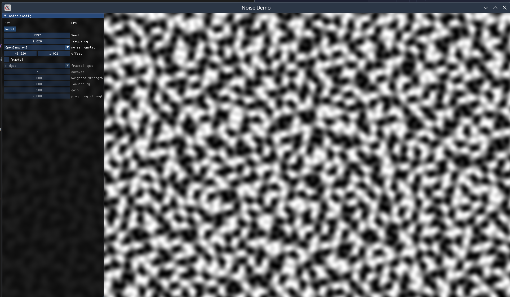
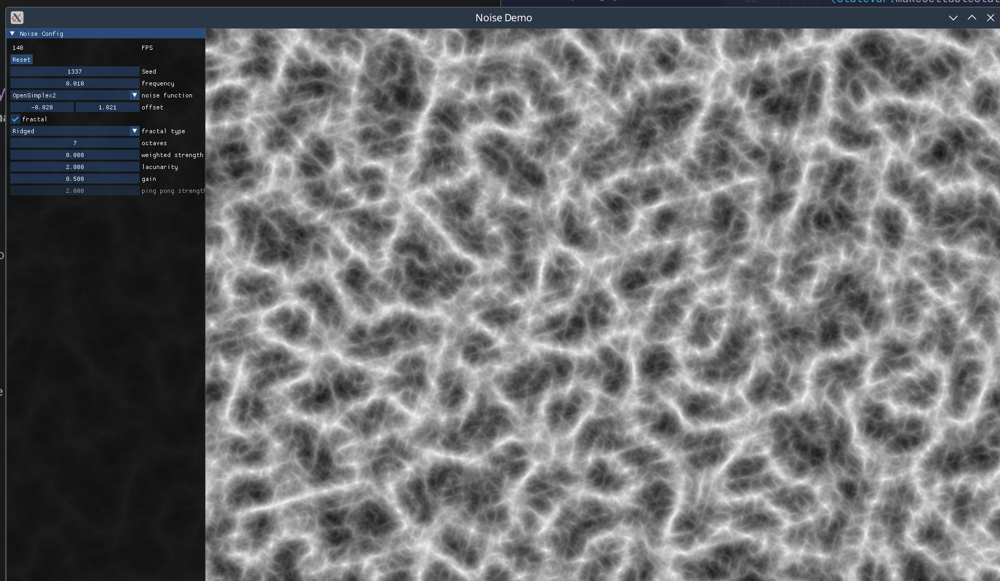
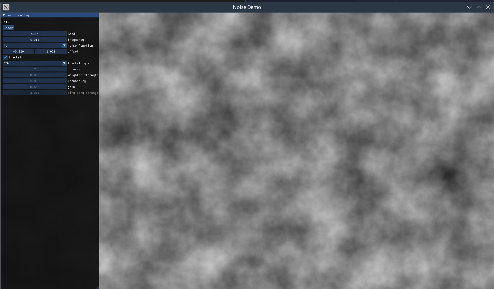
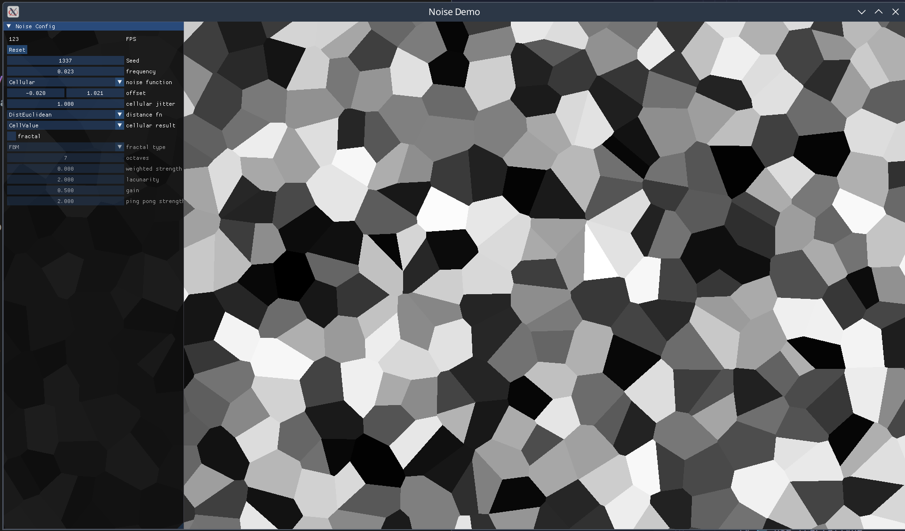
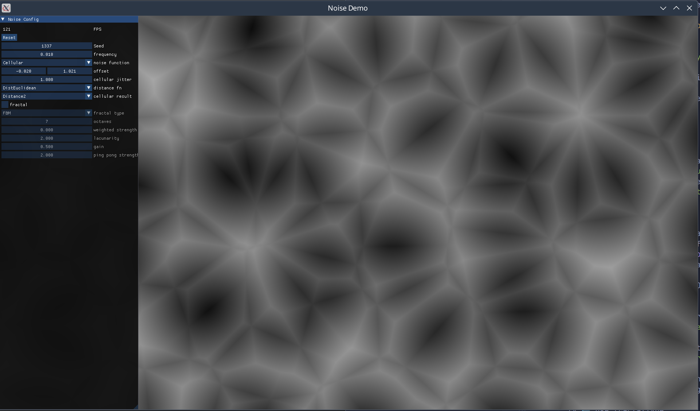

# pure-noise

Performant, modern noise generation for Haskell with a minimal dependency footprint.

The algorithms used in this library are ported from [FastNoiseLite](https://github.com/Auburn/FastNoiseLite). The library structure has been retuned to fit better with Haskell semantics.

The public interface for this library is unlikely to change much, although the implementations (`noiseBaseN` functions and anything in `Numeric.Noise.Internal`) are subject to change and may change between minor versions.

## Usage

The library exports newtypes for N-dimensional noise. Currently, these are just functions that accept a seed and a point in N-dimensional space. They can be arbitrarily unwrapped by with the `noiseNAt` family of functions. Since they abstract over the given seed and parameters, they can be composed with `Num` or `Fractional` methods at will with little-to-no performance cost.

Noise values are generally clamped to `[-1, 1]`, although some noise functions may occasionally produce values slightly outside this range.

```haskell
import Numeric.Noise qualified as Noise

myNoise2 :: (RealFrac a) => Seed -> a -> a -> a
myNoise2 =
  let fractalConfig = Noise.defaultFractalConfig
  in Noise.noise2At $
      Noise.fractal2 fractalConfig ((perlin2 + superSimplex2) / 2)
```

More examples can be found in `bench` and `demo`.

## Performance notes

- This library benefits considerably from compilation with the LLVM backend (`-fllvm`). Benchmarks suggest a ~50-80% difference depending on the kind of noise.

## Benchmarks

### Results

Measured by values / second generated by the noise functions. These results come from a benchmark with `-fllvm` enabled.

All results are for `Float`s.

There's inevitably some noise in the measurements because all of the results are forced into an unboxed vector.

#### 2D

| name          | values / second |
| ------------- | --------------- |
| value2        | 157_347_680     |
| perlin2       | 129_541_747     |
| openSimplex2  | 64_758_006      |
| superSimplex2 | 64_072_639      |
| valueCubic2   | 52_110_819      |
| cellular2     | 15_743_434      |

#### 3D

| name        | values / second |
| ----------- | --------------- |
| value3      | 85_438_023      |
| perlin3     | 56_830_482      |
| valueCubic3 | 15_559_523      |

## Examples

There's an interactive [demo app](demo/README.md) in the `demo` directory.

_OpenSimplex2_




_Perlin_



_Cellular_



